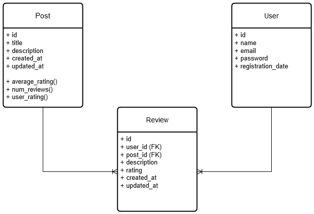

# Commentary System using Django REST Framework

To compete with Instagram, Google Play, and other rating based systems, I wrote this code to cover their shortcomings and limitations by the request of [‌BitPin](https://www.linkedin.com/company/bitpin/).

## Table of Contents

- [Design](#design)
- [Features & Implementations](#features--implementations)
  - [View Posts List](#view-posts-list)
  - [Add Review](#add-review)
  - [Test Cases](#test-cases)
- [Managing Sudden Influxes of Ratings](#managing-sudden-influxes-of-ratings)
  - [Introduction](#introduction)
  - [Our Solution: Customized Time-based Bayesian Average](#our-solution-customized-time-based-bayesian-average)
  - [Comparison of Different Approaches](#comparison-of-different-approaches)
- [How to run](#how-to-run)

## Design

We use the following models:

<p align="center">
<!--  -->

</p>

## Features & Implementations

### View Posts List

This feature retrieves a list of posts along with their average rating and the rating submitted by the user (if available).

The challenge is efficiently calculating the average rating. We could sure fetch all the ratings for the post and then calculate the average by summing up and dividing by the quantity. Now, this would be extremely slow if we have a lot of reviews for the posts.

Using the aggregate function, we make it more efficient by delegating all calculations to the DBMS. This also avoids a lot of traffic between the app and the DBMS since now we don’t need to fetch all the records from Review table.

```python
def average_rating(self) -> float:
        return Review.objects.filter(post=self).aggregate(Avg("rating"))["rating__avg"] or -1
```

But since we need to make this more efficient and customized, we take another approach that is explained further in this [section](#managing-sudden-influxes-of-ratings). Instead of calculating the average dynamically each time a user wants to see the posts list or adds a review, **we update the average of all posts on a timely-basis (every one second).**

This approach significantly decreases the number of processing requests while maintaining a good user experience.

**Note**: For simplicity and testing, I created an `updater_runner.py` script in the main Backend folder. This script runs the necessary tasks periodically, using the same virtual environment, instead of deploying a task scheduler like `Celery` or `cron jobs` which are more suited for production.

### Add Review

As asked from me by the authorities, users cannot delete their reviews! (_"Words once spoken can never be taken back."_)

Good news is, you can change your review and rating for a post! (_"An apology can sometimes alter things!"_)

### Test Cases

Tests for the following files are written in the `rating_app/tests/` directory:

- views
- serializers
- average updater

### Managing sudden influxes of ratings

#### Introduction

When a large number of reviews are suddenly submitted to a post—whether due to advertising, manipulation, or coordinated action—it can heavily skew the average rating. There are several articles (like [this link](https://www.fastercapital.com/content/Product-reviews-and-ratings--Rating-Algorithms--Decoding-Rating-Algorithms--What-They-Mean-for-Your-Business.html?utm_source=chatgpt.com)) which discuss the impact of ratings on products and suggest strategies to mitigate such issues.

Based on our project, here are some of the solutions that can be applied:

- [Time-based Weighted Average Rating](https://docs.timescale.com/use-timescale/latest/hyperfunctions/time-weighted-averages/)
- [Machine Learning Models](https://www.restack.io/p/ai-for-fraud-prevention-answer-detect-fraudulent-reviews-cat-ai?utm_source=chatgpt.com)
- [Bayesian Average](https://lukasmurdock.com/bayes-average/?utm_source=chatgpt.com)
- [Rate-Limiting](https://dev.to/satrobit/rate-limiting-using-the-token-bucket-algorithm-3cjh)

#### **Our Solution: Custimized Time-based Bayesian Average**

In the standard Bayesian model, as described in this [link](https://lukasmurdock.com/bayes-average/?utm_source=chatgpt.com), the formula is:

<p align="center">
  
$$
\text{Avg} = \frac{C \times M + \sum R}{C + N}
$$

</p>

Where:

- \( C \) is the minimum number of votes required (weighting factor).
- \( M \) is the mean rating across all items.
- \( $$\sum R$$ \) is the sum of all ratings for the item.
- \( N \) is the number of votes for the item.

But to calculate the average rating of a post independently from other posts ratings and to take into account the time factor, we adjust the `M` value as follows:

- \( M \) is the weekly updated average of the post.

For `C`, we consider tow approaches:

- **Fixed Approach**: Define `C` as a constant value like 100 or 1000 (based on the expected number of ratings).
- **Dynamic Approach**: Update `C` dynamically based on the total number of ratings received over time.

Since choosing an ideal fixed `C` is difficult due to varying factors affecting each post differently, we go with the former approach, which is better suited in situations where we don't want to preassumption about the number of ratings for a post. So, we define `C` as follows:

- \( C \) is the weekly updated total number of ratings so far.

With these modifications, our final formula becomes:

<p align="center">
  
$$
\text{Avg} = \frac{C \times M + \sum R}{C + N}
$$

</p>

Where:

- \( C \) is the weekly updated number of ratings.
- \( M \) is the weekly updated mean of the post.
- \( $$\sum R$$ \) is the sum of all ratings for the post.
- \( N \) is the current number of ratings for the post.

##### Key Takeaways:

- _Unlike the standard Bayesian method, this approach calculates the real average in the first week (M=C=0)._
- _A minor sudden average change occurs after each weekly update._

#### Comparison of Different Approaches:

|                **Method**                |                            **Description**                            |                         **Pros**                          |                         **Cons**                          |
| :--------------------------------------: | :-------------------------------------------------------------------: | :-------------------------------------------------------: | :-------------------------------------------------------: |
|             `Simple Average`             |           Computes the sum of ratings divided by the count            |                  Shows the real average                   |   Easily manipulated by mass voting, advertising, etc.    |
|      `Time-Based Weighted Average`       | Assigns more weight to older reviews, reducing the impact of new ones |          Prevents sudden changes in the average           |       In some cases, new reviews are more important       |
|             `Rate-Limiting`              |       Limits the rate of new ratings to prevent sudden changes        |               Prevents rating manipulation                |           Delays the effects of normal ratings            |
|        `Machine Learning Models`         |         Uses AI to classify reviews as genuine or fraudulent          |               Works well in most scenarios                |      Requires prior data and is complex to implement      |
| `Custimized Time-based Bayesian Average` |           Uses a Bayesian model with time-based adjustments           | Adapts to each post dynamically and considers all reviews | A minor sudden change occurs after the time-period update |

## How to run

Follow these steps to set up and run the project locally:

### 1. Install Dependencies

First, install the required dependencies from the `requirements.txt` file located in the root directory:

```bash
pip install -r requirements.txt
```

### 2. Set Up the Database

Navigate to the `Backend` directory of the project and Run the following commands:

```bash
python manage.py makemigrations rating_app
python manage.py migrate rating_app
```

### 3. Create a Superuser

To access the Django admin panel, create a superuser:

```bash
python manage.py createsuperuser
```

Follow the prompts to create the superuser account.

### 4. Run the Development Server

```bash
python manage.py runserver
```

By default, the server will run on `http://127.0.0.1:8000`.

### 5. Run the Updater

In a separate terminal window, run the `updater_runner.py` script to update average ratings:

```bash
python updater_runner.py
```

### 6. Access the Django Admin Panel

Visit `http://127.0.0.1:8000/admin` in your browser to access the admin panel. You can add users, posts, and reviews here.

### 7. View the List of Posts

To view the list of posts, navigate to:

```bash
http://127.0.0.1:8000/posts
```

Also, you can use tools like `Postman` or `curl` to retrieve the list of posts or add a review.
