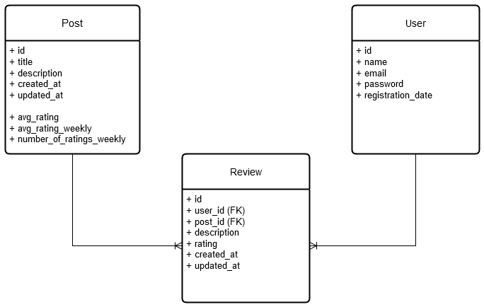

# Commentary System using Django REST Framework

To copmpete with Instagram, Google Play, and other rating based systems, I wrote this code to cover their shortcomings and limitations by the request of [‌BitPin](https://www.linkedin.com/company/bitpin/).

## Design

We use the following model:


## Features & Implementations

- [View Posts List](#view-posts-list)
- [Add or Update Reviews](#add-review)

### View Posts List

This feature is designed to return the list of posts among with their average rating and the rating that user has submitted for each post(if any).

The challenge of this feature is that calculating the average rating. We could sure fetch all the ratings for the post and then calculate the average by summing up and dividing by the quantity. Now, this would be extremely slow if we have a lot of reviews for the posts.

By using the aggregate function, we make it more efficient by delegating all calculations to the DBMS. This also avoids a lot of traffic between the app and the DBMS since now we don’t need to fetch all the records from Review table.

```
def average_rating(self) -> float:
        return Review.objects.filter(post=self).aggregate(Avg("rating"))["rating__avg"] or -1
```

### Add Review

Since asked from me by the authorities, users can not delete their reviews! (WORDS ONCE SPOKEN CAN NEVER BE TAKEN BACK.)

But the good news is, you can change your review and rating for a post! (BUT AN APOLOGY CAN SOMETIMES ALTER THINGS!)
